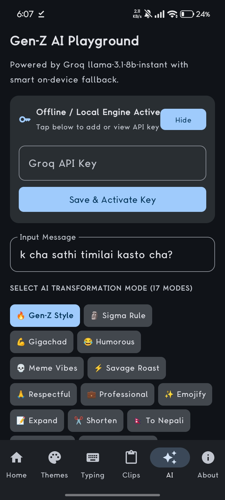
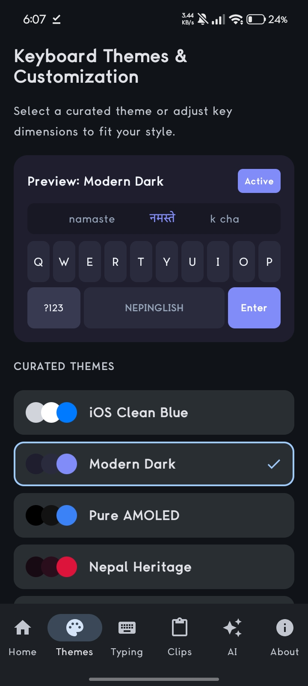
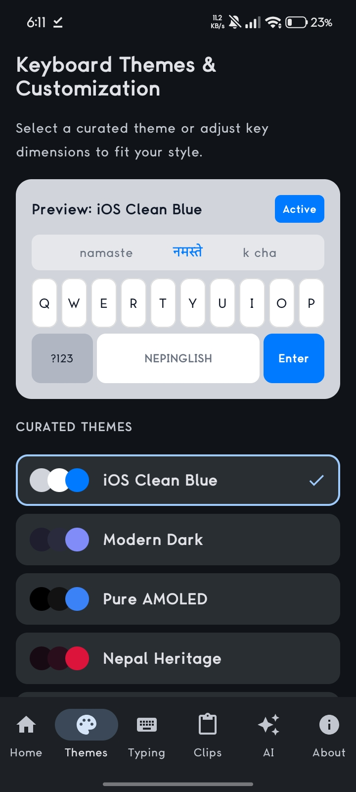
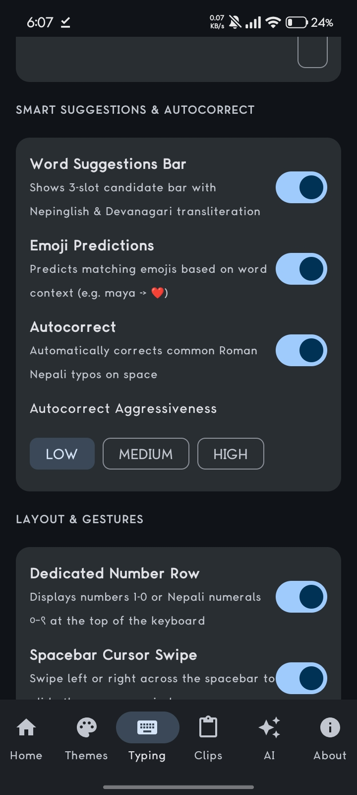
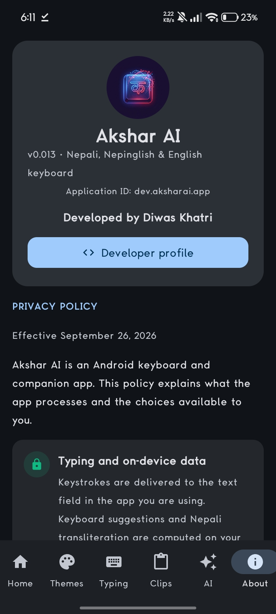

# Akshar AI - GenZ Keyboards 🇳🇵

**A Nepali Gen-Z keyboard for Nepali, Nepinglish and English—with on-device typing tools and optional AI writing assistance.** Built in Nepal by [Diwas Khatri](https://github.com/DiwasKhatri07).

<p align="center">
  <a href="https://github.com/DiwasKhatri07/AksharAi-GenZ-Keyboards/releases/latest"></a>
  <a href="https://github.com/DiwasKhatri07/AksharAi-GenZ-Keyboards/releases"></a>
  <a href="https://github.com/DiwasKhatri07/AksharAi-GenZ-Keyboards/actions/workflows/android-ci.yml"></a>
  <a href="LICENSE"></a>
  <a href="https://github.com/DiwasKhatri07/AksharAi-GenZ-Keyboards/stargazers"></a>
  <a href="https://github.com/DiwasKhatri07/AksharAi-GenZ-Keyboards/network/members"></a>
</p>

<p align="center">
  
  
  
  
</p>

> **Discoverability:** An open-source Android Nepali keyboard, Nepali typing app, Devanagari keyboard, Roman Nepali (Nepinglish) keyboard and Gen-Z AI keyboard. GitHub topics are listed below. GitHub controls search ranking; no ranking is guaranteed.

## Showcase

Screenshots are from the supplied app build. Search-history captures were deliberately not included in the public gallery.

<p align="center">
  
  
  
</p>
<p align="center">
  
  
</p>

**Video:** [Watch the submitted keyboard screen recording](docs/assets/akshar-keyboard-demo.mp4). It includes a browser page with an account identifier; see [showcase notes](docs/showcase.md).

## Features

- **Three typing modes:** Nepali Devanagari, Nepinglish/Roman Nepali and English QWERTY.
- **Nepali transliteration:** Convert Romanized input into Devanagari and switch language modes from the keyboard.
- **Gen-Z suggestions:** Nepinglish normalization, slang vocabulary, autocorrect, contextual emoji suggestions and a three-slot suggestions bar.
- **Gesture typing:** Swipe typing with dual-script candidates and spacebar cursor navigation.
- **Optional AI writing assistant:** 17 modes, including Gen-Z style, translation, grammar fixes, respectful/professional rewrites, captions and smart replies. Cloud requests use a configured Groq or Gemini key; local rule-based transformations provide a fallback.
- **Keyboard customization:** Curated themes, key size/corner controls, number row, haptics, sound and autocorrect options.
- **Everyday tools:** Local clipboard panel, voice typing through Android's selected recognition service, emoji suggestions and text-to-speech.
- **Sensitive-field safeguards:** Android-recognized password fields suppress keyboard learning and sensitive actions. The AI tool also blocks some numeric PIN/OTP/card-like patterns; these heuristics are not a substitute for avoiding confidential text.

## Download

The latest APKs and checksums are on the **[Releases page](https://github.com/DiwasKhatri07/AksharAi-GenZ-Keyboards/releases/latest)**. The current release is **v0.013**.

| File | Use |
| --- | --- |
| `AksharAI-GenZ-Keyboards-v0.013-release.apk` | Optimized, signed release for normal installation. |
| `AksharAI-GenZ-Keyboards-v0.013-debug.apk` | Larger debug build for testing and troubleshooting. |

The APKs use the same application ID but different signing certificates, so Android cannot keep both variants installed side by side. Uninstall one before switching; local app data may be removed. The release signing key is intentionally **not** included in this public repository.

## How it fits together

- `app/src/main/java/com/example/ime/` implements the Android `InputMethodService` and text-editor integration.
- `engine/nepali/`, `engine/nepinglish/`, `engine/prediction/`, `engine/swipe/` and `engine/emoji/` contain the local language, suggestion and gesture logic.
- `ui/keyboard/` implements the keyboard surfaces; `ui/screens/` contains setup, theme, settings, clips, AI and privacy screens.
- `data/local/` stores Room entities/queries; `data/preferences/` holds language, layout and feature settings.
- `ai/` routes optional transformations to Groq/Gemini and provides the local fallback. User API keys are never committed.

`Android CI` runs focused JVM tests and builds the debug APK on app-code changes. The repository-metrics job is separately scheduled; see [GitHub metrics](docs/github-metrics.md).

## Install and enable

1. Download the release APK from [Releases](https://github.com/DiwasKhatri07/AksharAi-GenZ-Keyboards/releases/latest) and install it. Android may ask you to allow installs from that browser/file manager.
2. Open **Settings → System → Languages & input → On-screen keyboard → Manage keyboards** (menu names differ by device).
3. Enable **Akshar AI GenZ Keyboard**, then select it from the keyboard picker in any text field.

A keyboard can process text typed into other apps. Review the [privacy policy](PRIVACY.md) before enabling it, and install keyboards only from sources you trust.

## Build from source

**Requirements:** JDK 21 (JDK 17 may work with a compatible Android Studio setup), Android SDK Platform 36, and an internet connection for Gradle dependencies.

```bash
git clone https://github.com/DiwasKhatri07/AksharAi-GenZ-Keyboards.git
cd AksharAi-GenZ-Keyboards
cp .env.example .env # optional: add your own Groq/Gemini key; never commit .env
./gradlew testDebugUnitTest
./gradlew assembleDebug
```

Debug output: `app/build/outputs/apk/debug/app-debug.apk`.

For an optimized release build, create and keep your own signing key private, then set `KEYSTORE_PATH`, `STORE_PASSWORD` and `KEY_PASSWORD` in your shell and run `./gradlew assembleRelease`. **Never put a signing key, API key, `.env` file or password in a commit or issue.** A personal release signature will not match the distributed v0.013 release key.

## Privacy and AI

Typing suggestions and transliteration are computed on-device. Settings, clipboard entries and opt-in AI history are stored locally by the app. If you choose an AI action and have a provider key configured, the selected text may be sent to Groq or Google Gemini over HTTPS; provider privacy/retention terms then apply. Without a working cloud key, the app can fall back to its local rule engine. Voice recognition is handled by the Android speech service you select. The custom API key is stored in app-private preferences and is not encrypted by the app itself. See [PRIVACY.md](PRIVACY.md) for scope and controls.

## Contributing

Bug reports, Nepali dictionary improvements, translations, accessibility feedback, test cases and Kotlin/Compose contributions are welcome. Please read [CONTRIBUTING.md](CONTRIBUTING.md) and the [Code of Conduct](CODE_OF_CONDUCT.md). CI runs on pushes and pull requests. For a security issue, follow [SECURITY.md](SECURITY.md) and report it privately.

## GitHub metrics and search data

The repository-metrics workflow refreshes public counters every **10 minutes** on a best-effort schedule. It records aggregate repository/release metrics in [`metrics/latest.json`](metrics/latest.json). GitHub may delay scheduled jobs, and its built-in traffic insights cover recent aggregate page views, clones and referrals—not named visitors or the exact search phrases people typed. To optionally collect traffic-graph data, add a fine-grained `TRAFFIC_API_TOKEN` repository secret with **Administration: read** access; without it the public metrics still refresh. See [the workflow notes](docs/github-metrics.md).

**We cannot identify who searched GitHub for “Nepali keyboard” or retrieve GitHub search keywords.** No username-level visitor tracking is added to this repository.

## Project details

- **App name:** Akshar AI - GenZ Keyboards
- **Application ID:** `dev.aksharai.app`
- **Current version:** `v0.013` (version code 13)
- **Built with:** Kotlin, Jetpack Compose, Android InputMethodService, Room and Coroutines.
- **Origin:** Made in Nepal 🇳🇵 by [Diwas Khatri](https://github.com/DiwasKhatri07).
- **License:** [MIT](LICENSE).

### GitHub topics

`android` · `android-keyboard` · `android-ime` · `input-method-editor` · `nepali` · `nepal` · `nepali-language` · `nepali-keyboard` · `nepali-typing` · `nepinglish` · `roman-nepali` · `devanagari` · `genz` · `ai-keyboard` · `kotlin` · `jetpack-compose` · `swipe-typing` · `open-source` · `multilingual-keyboard` · `android-app`
